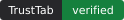
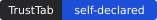
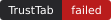
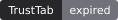
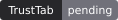

# TrustTab

**Verified, agent-ready forms.** TrustTab lets a website declare which of its
forms are safe and correctly structured for an AI agent to act on (a contact
form, a booking page, a support ticket), verifies that claim automatically, and
issues a badge that anyone can check against a public registry.

> **Status: early development.** This repository is being built in the open.
> The full loop works: claim a domain, publish a signed manifest, get
> checked, and show a live badge. Expect rough edges (see [Roadmap](#roadmap)).

## Why this exists

AI agents are starting to fill in forms on people's behalf. That raises two
questions a site owner currently has no standard way to answer:

1. **Can an agent use this form correctly?** Which fields it takes, what they
   mean, and whether the form is intended for automated use at all.
2. **Is the page safe for an agent to read?** Hidden text and "ignore previous
   instructions"-style content can hijack an agent that visits the page.

TrustTab gives sites a way to publish those answers in a machine-readable
manifest at `/.well-known/agent-trust.json`, and gives agents (and people) a way
to confirm the manifest was independently checked and is still current.

### What TrustTab is not

TrustTab is **not** an agent-identity or payments protocol. Efforts like Visa's
Trusted Agent Protocol and Google's AP2 verify that an *agent* is real and
authorized to act for someone. TrustTab is complementary: it verifies the
*site* the agent is about to interact with.

## How verification works

1. **Claim your domain.** Sign up, enter your domain, and add the generated tag
   to the `<head>` of your homepage:

   ```html
   <meta name="agenttrust-verify" content="YOUR_TOKEN">
   ```

   Click **Check now**. TrustTab fetches `https://your-domain/` and confirms
   the tag is present.

2. **Declare your agent-safe endpoints.** Describe each form: its path,
   method, purpose (from a fixed, centrally maintained list such as
   `lead_inquiry` or `booking`) and field schema. TrustTab signs the manifest
   and serves it. Point your site at it with a `/.well-known/agent-trust.json`
   redirect or an `agent-trust-manifest` tag on your homepage (see [Discovery](#discovery)).

3. **Get checked.** TrustTab confirms each declared form exists with the
   declared fields, scans the page for hidden prompt-injection content,
   checks HTTPS, and makes sure the manifest's domain matches the domain
   serving it. Click **Re-check now** to run the checks. The manifest is
   re-signed after every run to reflect the result.

   | Check | Passes when |
   | --- | --- |
   | Endpoint match | Each declared page has a server-rendered `<form>` containing every declared field name |
   | Injection scan | No instruction-override phrases or chat-template markers, and no hidden text directing AI agents |
   | HTTPS | Pages load over HTTPS with valid certificates |
   | Domain match | The discovered manifest is signed for *this* domain and registration |
   | Expiry | That served manifest hasn't expired |

   **Forms rendered by JavaScript.** TrustTab reads server-rendered HTML, so it
   can't see forms that only appear after client-side JavaScript runs. For
   those, an owner can **self-attest** the endpoint. If every other check
   passes, the site gets the separate **Self-declared** status, never
   "Verified". The manifest marks each endpoint's `verified_by` as `issuer`
   (confirmed) or `owner` (self-attested only). Self-attestation never covers a
   page that fails to load or any check other than the form match.

   | Status | Meaning | Badge |
   | --- | --- | --- |
   | Verified | Every automated check passed |  |
   | Self-declared | Everything passed except forms the owner self-attests |  |
   | Needs fixes | Some checks failed |  |
   | Failed | Content that could manipulate AI agents was found |  |
   | Expired | Was verified or self-declared, but not re-checked in time |  |
   | Pending | Not checked yet |  |

4. **Show the badge.** Embed the snippet from your dashboard. It displays your
   live status and links to a public verification page on the issuer.

## Public API

| Endpoint | Returns |
| --- | --- |
| `GET /api/manifest/:domain` | The live signed manifest for a domain |
| `GET /api/verify/:verificationId` | `{ verification_id, status, domain, verified_at, expires_at, issuer, manifest_url, self_declared_endpoints }`. `status` is `verified`, `self_declared`, `pending`, `needs_fix`, `failed` or `expired` |
| `GET /api/badge/:verificationId.svg` | Live status badge |
| `GET /.well-known/jwks.json` | The issuer's public signing keys |

All public endpoints send `Access-Control-Allow-Origin: *` and are rate-limited
per client IP (120 requests/minute for the manifest and verify endpoints, 300
for badges, and 60 for the human-readable `/verify/:verificationId` page). Requests to the manifest and verify endpoints appear in the site
owner's traffic log.

**Privacy:** the traffic log stores only a truncated client IP (IPv4 /24, IPv6
/48) and a user agent, and rows are deleted after 30 days. Rate limiting (for
these endpoints and for sign-in/sign-up) is counted in Postgres under a keyed
hash of the IP, so no raw addresses are stored.

## The manifest

The manifest format is defined by [`agent-trust.schema.json`](./agent-trust.schema.json)
(JSON Schema 2020-12, **version 1.0 draft**). An abbreviated example:

```json
{
  "version": "1.0",
  "issuer": { "name": "TrustTab", "url": "https://trusttab.example", "verification_id": "tt_3v5urc2st37r" },
  "site": {
    "domain": "acme-plumbing.com",
    "verification_status": "unverified",
    "verified_at": null,
    "expires_at": "2026-10-14T18:00:00.000Z",
    "signature": "eyJhbGciOiJFZERTQSIsImtpZCI6Ii4uLiJ9..3q2-7w..."
  },
  "policy": {
    "no_prompt_injection_pledge": true,
    "agent_rate_limit": { "requests_per_minute": 20, "captcha_exempt": true },
    "content_scan": { "last_scanned": null, "status": "pending" }
  },
  "endpoints": [
    {
      "path": "/contact",
      "method": "POST",
      "purpose": "lead_inquiry",
      "schema": { "name": "string", "email": "email", "service": "enum[repair,install]", "notes": "string?" },
      "agent_safe": true,
      "requires_captcha": false,
      "self_attested": false,
      "verified_by": null
    }
  ]
}
```

`verification_status: "unverified"` and `content_scan.status: "pending"` mean
the manifest is signed but hasn't been checked yet. **Agents should treat a
manifest as verified only when `verification_status` is `"verified"` (which is
the only case where `verified_at` is set) and `expires_at` is in the future.**
`"self_declared"` means TrustTab could not confirm every form: rely only on
endpoints whose `verified_by` is `"issuer"`.

A site's live manifest is served at `<issuer>/api/manifest/<domain>`.

### Discovery

Agents find a site's manifest in one of two places, checked in this order:

1. **`https://<domain>/.well-known/agent-trust.json`**, typically a redirect to
   the issuer URL above.
2. **A tag in the homepage `<head>`**, for platforms that reserve
   `/.well-known/` (many hosted site builders do). Either form works; some
   builders keep custom `<meta>` tags but strip custom `<link>` tags:

   ```html
   <meta name="agent-trust-manifest" content="https://<issuer>/api/manifest/<domain>">
   <link rel="agent-trust-manifest" href="https://<issuer>/api/manifest/<domain>">
   ```

If the well-known path serves a manifest, that one wins. Either way, always
check the manifest's signature and that `site.domain` matches the site you're
on.

### Verifying a signature yourself

`site.signature` is a detached compact JWS ([RFC 7515](https://www.rfc-editor.org/rfc/rfc7515))
using Ed25519 (`alg: EdDSA`). To verify:

1. Split the signature into `header`, an empty segment, and `sig` on `.`.
2. Decode `header` (base64url JSON) and read `kid`.
3. Fetch `<issuer.url>/.well-known/jwks.json` and pick the key with that `kid`.
   Only trust keys from an issuer you trust (see below).
4. Remove `site.signature` from the manifest and serialize the rest with
   [RFC 8785](https://www.rfc-editor.org/rfc/rfc8785) JSON canonicalization.
5. Verify `sig` over the ASCII bytes `header + "." + base64url(canonical JSON)`.

Any standard JOSE library that supports detached payloads and EdDSA can do
steps 4–5.

## Open source and the hosted registry

The code is MIT-licensed. Anyone can read it, fork it and run their own
instance. A badge, though, only means as much as the registry it resolves
against. A self-hosted instance issues badges that verify against *its own*
keys, and the canonical TrustTab badge is the one that resolves against the
official hosted service. It's the same model as Let's Encrypt: open code, with
one widely trusted issuer in practice. Issuer identity and signing keys are
configured through environment variables, never hard-coded.

## Tech stack

- [Next.js 16](https://nextjs.org) (App Router) + TypeScript
- Postgres with [Drizzle ORM](https://orm.drizzle.team)
- [Better Auth](https://www.better-auth.com) (email/password)
- Tailwind CSS
- [cheerio](https://cheerio.js.org) for HTML parsing, [undici](https://undici.nodejs.org) for hardened outbound fetches
- [Ajv](https://ajv.js.org) for schema validation; Node's built-in `crypto` for Ed25519 signing

## Self-hosting / local development

### Prerequisites

- Node.js 20.9 or newer
- A Postgres database (local, or hosted: Neon, Supabase, RDS…)

### Setup

```bash
git clone <this repo> trusttab && cd trusttab
npm install
cp .env.example .env.local   # then fill in the values
npm run db:migrate           # create tables
npm run dev                  # http://localhost:3000
```

`.env.local` needs:

| Variable | Purpose |
| --- | --- |
| `DATABASE_URL` | Postgres connection string |
| `BETTER_AUTH_SECRET` | Session signing secret. Generate one with `openssl rand -base64 32` |
| `BETTER_AUTH_URL` | Public base URL of the deployment, e.g. `http://localhost:3000` |
| `TRUSTTAB_ISSUER_NAME` | Issuer name written into signed manifests |
| `TRUSTTAB_ISSUER_URL` | Public `https://` base URL of this instance, written into manifests |
| `TRUSTTAB_SIGNING_PRIVATE_KEY` | Ed25519 signing key. Generate with `npm run keys:generate` and back it up |
| `AGENTTRUST_VERIFY_TOKEN` | *Optional.* Makes this deployment publish its own verification tag so it can claim its own domain |

### Deploying to Vercel

1. Import the repository into Vercel.
2. In the project's **Storage** tab, add a Neon Postgres database. This sets
   `DATABASE_URL` for you.
3. Add `BETTER_AUTH_SECRET`, `BETTER_AUTH_URL`, `TRUSTTAB_ISSUER_NAME`,
   `TRUSTTAB_ISSUER_URL` and `TRUSTTAB_SIGNING_PRIVATE_KEY` under
   **Settings → Environment Variables**.
4. Run migrations against the production database from your machine:
   `vercel env pull .env.production.local`, then
   `DATABASE_URL=<direct, unpooled URL> npm run db:migrate`. With Neon, that's
   `DATABASE_URL_UNPOOLED`. Keep the pulled file out of the repo and delete it
   afterwards.
5. Deploy.

**Self-hosting elsewhere:** run TrustTab behind a reverse proxy that
overwrites `X-Forwarded-For` with the real client IP. Rate limiting and the
traffic log rely on that header, and without such a proxy clients can claim
any IP. Accounts are limited to 10 sites (`MAX_SITES_PER_USER`) to bound
outbound verification traffic.

### Useful scripts

| Script | What it does |
| --- | --- |
| `npm run dev` | Start the dev server |
| `npm run build` | Production build (includes type checking) |
| `npm test` | Unit tests (Node's built-in test runner) |
| `npm run lint` / `npm run typecheck` | Static checks |
| `npm run keys:generate` | Print a new manifest-signing key |
| `npm run db:generate` | Generate a SQL migration after editing `src/db/schema.ts` |
| `npm run db:migrate` | Apply pending migrations |
| `npm run db:studio` | Browse the database with Drizzle Studio |

## Project layout

```
src/
  app/                  pages and API routes (App Router)
    api/auth/[...all]   Better Auth endpoints
    api/sites/          domain claims, ownership checks, manifest publishing, verification
    api/manifest/       public manifest lookup
    api/verify/         public registry lookup
    api/badge/          live status badge (SVG)
    verify/             public verification page (badge link target)
    .well-known/        public signing keys (JWKS)
    dashboard/          signed-in UI
  components/           UI components
  db/                   Drizzle schema and client
  proxy.ts              request proxy (rate-limits the public verification page)
  lib/
    auth.ts             Better Auth config and session helpers
    domain.ts           domain normalization and validation
    ownership.ts        verification token and meta-tag check
    safe-fetch.ts       SSRF-hardened fetch for user-supplied sites
    manifest/           build, canonicalize, sign, validate manifests
    verification/       verification checks and engine
agent-trust.schema.json manifest format (JSON Schema)
drizzle/                generated SQL migrations
```

## Roadmap

- [x] Accounts (email/password)
- [x] Domain claim + ownership verification via meta tag
- [x] Manifest generator: declare endpoints, validate against the schema, sign, serve at `/api/manifest/[domain]`
- [x] Verification engine: endpoint/field match, prompt-injection scan, HTTPS, domain match, expiry
- [x] Public verify endpoint, badge SVG, request log
- [x] `agent-trust-manifest` homepage tag discovery for platforms that reserve `/.well-known/`
- [x] Self-attestation for forms rendered by JavaScript (shown as "Self-declared", never "Verified")
- [x] Rate limiting and IP minimization on public endpoints
- [x] Sign-in/sign-up rate limiting that holds across serverless instances
- [ ] Automatically check forms rendered by client-side JavaScript (headless browser)
- [ ] Scheduled re-verification

## Contributing

See [CONTRIBUTING.md](./CONTRIBUTING.md).

## Security

If you find a vulnerability, please don't open a public issue. Report it
privately through GitHub's
[private vulnerability reporting](https://docs.github.com/en/code-security/security-advisories/guidance-on-reporting-and-writing-information-about-vulnerabilities/privately-reporting-a-security-vulnerability)
on this repository.

## License

[MIT](./LICENSE)
